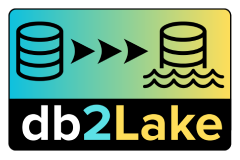

<p align="center">
  
</p>

# @db2lake BigQuery Destination Driver

This package provides a high-performance BigQuery destination driver for the [`@db2lake`](https://www.npmjs.com/package/@db2lake) data pipeline framework. It enables efficient data loading into BigQuery tables with support for both batch and streaming writes. The driver utilizes the [`@google-cloud/bigquery`](https://www.npmjs.com/package/@google-cloud/bigquery) SDK for optimal performance and implements intelligent resource management.

## Features
- Lazy connection initialization for optimal resource usage
- Automatic dataset and table creation with schema management
- High-performance batch processing with configurable sizes
- Support for streaming writes via BigQuery write streams
- Intelligent batch buffering and automatic flushing
- Robust error handling and resource cleanup
- Full TypeScript support with generic types
- Configurable write modes (append/truncate)

## Installation & Setup

Install the package:

```bash
npm install @db2lake/driver-bigquery
```

Set up Google Cloud credentials:
- Create a service account and download the JSON key file
- Provide the key via `bigQueryOptions.keyFilename` or set `GOOGLE_APPLICATION_CREDENTIALS=/path/to/key.json`
- Never commit credentials to source control

## Project Structure
```
├── src/
│   └── index.ts  # BigQueryDestinationDriver implementation
│   └── type.ts   # Configuration type definitions
└── package.json  # Package metadata and dependencies
```

## Usage Examples

### Basic Table Insert

```typescript
import { BigQueryDestinationDriver, BigQueryConfig } from '@db2lake/driver-bigquery';

const config: BigQueryConfig = {
  bigQueryOptions: {
    keyFilename: './service-account.json',
    projectId: 'my-project-id'
  },
  dataset: 'my_dataset',
  table: 'users',
  batchSize: 1000,
  // Optional: use streaming for real-time inserts
  writeOptions: {
    sourceFormat: 'NEWLINE_DELIMITED_JSON'
  }
};

const driver = new BigQueryDestinationDriver<{name: string; age: number}>(config);
try {
  // Connection is optional - will be established on first insert
  await driver.connect();
  
  const users = [
    { name: 'John', age: 30 },
    { name: 'Jane', age: 25 }
  ];
  
  await driver.insert(users);
  // Batches are automatically flushed when reaching batchSize
} finally {
  await driver.close(); // Ensures all pending data is written
}
```

### Advanced Usage with Schema Creation and Streaming

```typescript
import { BigQueryDestinationDriver, BigQueryConfig } from '@db2lake/driver-bigquery';

interface OrderRecord {
  id: number;
  customer: string;
  amount: number;
  created_at: Date;
}

const config: BigQueryConfig = {
  bigQueryOptions: {
    keyFilename: './service-account.json',
    projectId: 'my-project-id'
  },
  dataset: 'my_dataset',
  table: 'orders',
  createTableOptions: {
    schema: [
      { name: 'id', type: 'INTEGER' },
      { name: 'customer', type: 'STRING' },
      { name: 'amount', type: 'NUMERIC' },
      { name: 'created_at', type: 'TIMESTAMP' }
    ],
    description: 'Order transactions table with automatic timestamp'
  },
  writeDisposition: 'WRITE_APPEND',
  batchSize: 500,
  writeOptions: {
    sourceFormat: 'NEWLINE_DELIMITED_JSON',
    createDisposition: 'CREATE_IF_NEEDED',
    writeDisposition: 'WRITE_APPEND',
    schema: {
      fields: [
        { name: 'id', type: 'INTEGER' },
        { name: 'customer', type: 'STRING' },
        { name: 'amount', type: 'NUMERIC' },
        { name: 'created_at', type: 'TIMESTAMP' }
      ]
    }
  }
};

const driver = new BigQueryDestinationDriver<OrderRecord>(config);
try {
  const orders: OrderRecord[] = [
    { 
      id: 1, 
      customer: 'John Doe', 
      amount: 150.75,
      created_at: new Date()
    }
  ];
  
  // Table will be created automatically if needed
  await driver.insert(orders);
} finally {
  await driver.close();
}
```

## Configuration Options

### Connection Options
- **bigQueryOptions**: BigQuery client configuration (required)
  ```typescript
  {
    keyFilename?: string;      // Path to service account key file
    projectId: string;         // Google Cloud project ID
    credentials?: Credentials; // Or direct credentials object
    // ... other BigQuery options
  }
  ```

### Dataset and Table Options
- **dataset**: BigQuery dataset ID (required)
- **table**: BigQuery table ID (required)
- **batchSize**: Maximum rows per batch (default: 1000)
- **writeDisposition**: 'WRITE_APPEND' or 'WRITE_TRUNCATE'

### Table Creation Configuration
- **createTableOptions**: Settings for automatic table creation
  ```typescript
  {
    schema: string | TableSchema; // "name:STRING,age:INTEGER" or schema object
    expirationTime?: number;      // Table expiration in ms from epoch
    description?: string;         // Table description
  }
  ```

### Write Stream Options
- **writeOptions**: Configuration for streaming writes
  ```typescript
  {
    sourceFormat?: string;        // e.g., 'NEWLINE_DELIMITED_JSON'
    createDisposition?: string;   // e.g., 'CREATE_IF_NEEDED'
    writeDisposition?: string;    // e.g., 'WRITE_APPEND'
    schema?: TableSchema;         // Schema for streaming writes
    // ... other load job options
  }
  ```

## Best Practices

### Resource Management
```typescript
const driver = new BigQueryDestinationDriver(config);
try {
  // Connection is established automatically on first insert
  await driver.insert(batch1);
  await driver.insert(batch2);
} finally {
  // ALWAYS close to ensure pending data is written
  await driver.close();
}
```

### Batch Size Optimization
- For standard inserts: 500-1000 rows per batch
- For streaming: 100-500 rows for lower latency
- Monitor memory usage and adjust accordingly

### Error Handling
```typescript
const driver = new BigQueryDestinationDriver(config);
try {
  await driver.insert(rows);
} catch (error) {
  if (error.code === 404) {
    // Handle table/dataset not found
  } else if (error.code === 400) {
    // Handle invalid data format
  } else {
    // Handle other errors
  }
  throw error;
} finally {
  await driver.close();
}
```

## TypeScript Integration

### Type-Safe Row Definitions
```typescript
interface UserRecord {
  name: string;
  age: number;
  active: boolean;
  lastLogin?: Date;
}

const driver = new BigQueryDestinationDriver<UserRecord>(config);
// TypeScript will ensure all inserted rows match UserRecord
await driver.insert([
  { name: 'John', age: 30, active: true },
  { name: 'Jane', age: 25, active: true, lastLogin: new Date() }
]);
```

## License

MIT
